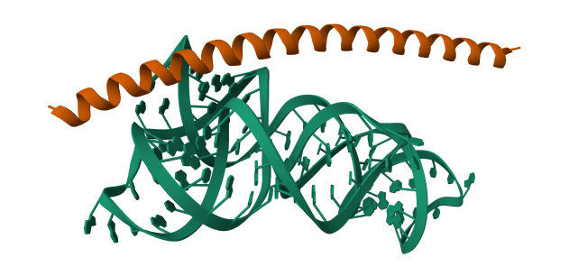
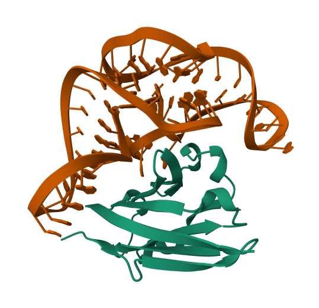

# UniESMBinderDesign

Gradient-guided binder design built on [ESMFold2](https://huggingface.co/biohub/ESMFold2).

| Script | What it designs |
|---|---|
| `uni_binder_design.py` | RNA/DNA aptamers against protein targets; protein minibinders against RNA/DNA |
| `design_atp.py` | DNA aptamers against small-molecule ligands (CCD code) (still working) |

---

## Installation

Only ESMFold2 is required. Follow the setup instructions in the [biohub/ESMFold2](https://huggingface.co/biohub/ESMFold2) repository.

Weights download automatically on first run to `invESM/lib/pretrained/`. Set `HF_HUB_CACHE` before running to use a different path.

---

## `uni_binder_design.py` — General binder design

Supports protein, RNA, and DNA designing chains against protein, RNA, or DNA targets.

- Design RNA or DNA aptamers against a protein target
- Design protein minibinders against an RNA or DNA target
- Pin specific positions to fixed residues/nucleotides
- ESMC-6B pseudoperplexity regularization for protein designing chains (skipped automatically for RNA/DNA)

### Quick start

```bash
python uni_binder_design.py
```

### Examples

**Design an RNA aptamer against PD-L1**

```python
from uni_binder_design import UniBinderDesign, make_design_spec

PDL1 = (
    "AFTVTVPKDLYVVEYGSNMTIECKFPVEKQLDLAALIVYWEMEDKNIIQFVHGEEDLKVQHSSYRQRAR"
    "LLKDQLSLGNAALQITDVKLQDAGVYRCMISYGGADYKRITVKVNA"
)

runner = UniBinderDesign()
runner.load(load_esmc=False)   # RNA design does not need ESMC

spec = make_design_spec("rna", 60)
sequences, trajectory, results = runner.design(
    target_sequence=PDL1,
    design_spec=spec,
    target_mol_type="protein",
    seed=42,
)
print(sequences)
```

Pin specific nucleotide positions (0-based):

```python
spec = make_design_spec("rna", 60, fixed_positions={0: "G", 1: "G", 58: "C", 59: "C"})
```

**Design a protein minibinder against an RNA target**

```python
from uni_binder_design import UniBinderDesign, make_design_spec

RNA_8DP3 = "GGUAAAACAGCCUGUGGGUGAAACACACCCACAGGGCCCAUUGGGCGCUAGCACUCUGGUAUCACCGUACCUUUGUGCGCCUGUUUUACC"

runner = UniBinderDesign()
runner.load(load_esmc=True)   # protein designing chain uses ESMC regularization

spec = make_design_spec("protein", 60)
sequences, trajectory, results = runner.design(
    target_sequence=RNA_8DP3,
    design_spec=spec,
    target_mol_type="rna",
    seed=0,
)
print(sequences)
```



**RNA aptamer targeting a protein**



### API

#### `make_design_spec(mol_type, length_or_sequence, fixed_positions=None)`

| Parameter | Type | Description |
|---|---|---|
| `mol_type` | `"protein"` \| `"rna"` \| `"dna"` | Molecule type of the chain being designed |
| `length_or_sequence` | `int` or `str` | Integer → fully mutable chain of that length. String → sequence with `#` at mutable positions, e.g. `"GGG###CCC"` |
| `fixed_positions` | `dict[int, str]` | Optional `{0-based index: residue}` pins applied on top |

#### `UniBinderDesign.load(use_scaling_critics, load_esmc, cache_dir)`

| Parameter | Default | Description |
|---|---|---|
| `use_scaling_critics` | `False` | Load 15 additional critic models for better scoring (high VRAM cost) |
| `load_esmc` | `True` | Load standalone ESMC-6B for protein pseudoperplexity regularization. Set `False` for RNA/DNA design to save ~12 GB VRAM |
| `cache_dir` | `CACHE_DIR` | Local path to the HuggingFace weights cache |

#### `UniBinderDesign.design(...)`

| Parameter | Default | Description |
|---|---|---|
| `target_sequence` | — | Target molecule sequence (protein one-letter code, or RNA/DNA IUPAC single-letter) |
| `design_spec` | — | `DesignSpec` from `make_design_spec()` |
| `target_mol_type` | `"protein"` | Molecule type of the **target** (`"protein"`, `"rna"`, or `"dna"`) |
| `is_antibody` | `False` | Reduce ESMC regularization weight from 0.15 → 0.05; use for antibody CDR loops |
| `seed` | `0` | Random seed |
| `batch_size` | `1` | Number of sequences optimized in parallel |
| `output_dir` | `Path("designs")` | Directory for saved structures and `critic_results.json` |
| `hotspot_indices` | `None` | List of 0-based target residue indices to pull the binder toward |
| `save_interval` | `10` | Save a structure every N low-temperature steps |

Returns `(sequences, trajectory, results)`:
- `sequences` — `list[str]` of designed sequences, one per batch element
- `trajectory` — step-indexed dict of per-step loss tensors
- `results` — list of per-sequence dicts with final `iptm` and loss breakdown

### Hyperparameters

Set at the top of `uni_binder_design.py`:

| Constant | Default | Description |
|---|---|---|
| `STEPS` | `150` | Optimization steps |
| `LEARNING_RATE` | `0.1` | SGD learning rate |
| `TEMPERATURE_MIN` | `1e-2` | Final softmax temperature (cosine-annealed from 1.0) |
| `LOSS_WEIGHTS` | `intra=0.5, inter=0.5, glob=0.2, hotspot=1.0` | Contact, globularity, and hotspot loss weights |
| `LM_WEIGHT_PROTEIN` | `0.15` | ESMC pseudoperplexity weight for protein chains |
| `LM_WEIGHT_ANTIBODY` | `0.05` | ESMC pseudoperplexity weight when `is_antibody=True` |
| `ESMC_MASK_FRACTION` | `0.15` | Masked position fraction per pseudoperplexity call |
| `REUSE_ESMC` | `True` | Share ESMC-6B backbone between folding trunk and standalone LM (saves ~12 GB VRAM) |
| `CHECKPOINT_INVERSION` | `True` | Activation checkpointing on the folding trunk (~60% activation memory reduction) |

---


## Roadmap

- [ ] Design macromolecules (RNA/DNA aptamers, protein binders) targeting small-molecule ligands — generalizing `design_atp.py` to arbitrary CCD or SMILES targets
- [ ] RNA language model regularization for RNA designing chains (analogous to ESMC pseudoperplexity for proteins)

---

## Citation

If you use this code, please cite:

```bibtex
@software{li2026uniesmb,
  title   = {{UniESMBinderDesign}: Gradient-guided binder design for protein, RNA, and DNA targets},
  year    = {2026},
  url     = {https://github.com/yourusername/UniESMBinderDesign}
}
```

This work builds on ESMFold2:


**Author:** Yang Li and claude code
